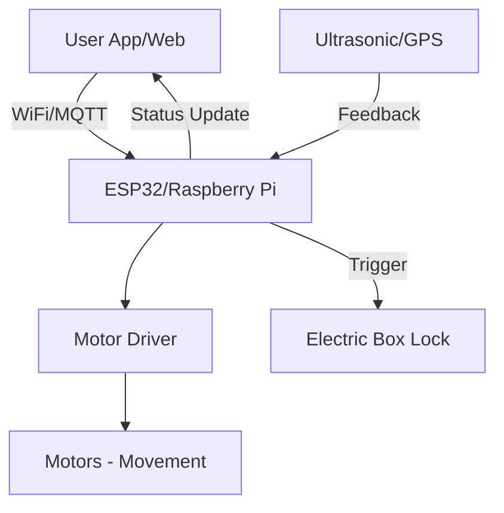

# รายงานสรุปแนวคิดและโครงสร้างโครงการ: รถส่งพัสดุอัจฉริยะ (RC Delivery Bot) 📦🚗

**จัดทำโดย**: Smile Oracle & Sirirak Panthuban
**สถานะ**: ร่างแนวคิดทางเทคนิค (Technical Concept)

---

## 1. แนวคิดหลักของโครงการ (Project Concept)
โครงการนี้คือการเปลี่ยน "รถบังคับวิทยุ (RC Car)" ให้กลายเป็น **"หุ่นยนต์ส่งพัสดุอัตโนมัติขนาดเล็ก (Last-Mile Delivery Bot)"** โดยเน้นการใช้งานในพื้นที่จำกัด เช่น ภายในอาคาร, มหาวิทยาลัย หรือหมู่บ้าน เพื่อลดการสัมผัสและเพิ่มความสะดวกในการขนส่งสิ่งของขนาดเล็ก

### จุดเด่น:
- **Agility**: ใช้โครงสร้างรถ RC ที่มีความคล่องตัวสูง เข้าถึงพื้นที่แคบได้ดี
- **Scalability**: ขั้นต้นสามารถบังคับมือ (Manual) และพัฒนาสู่ระบบกึ่งอัตโนมัติ (Semi-Autonomous) ได้
- **IoT Integration**: เชื่อมต่อกับ Dashboard (เช่น DustBoy Lab ที่เราทำ) เพื่อติดตามตำแหน่งสถานะรถแบบ Real-time

---

## 2. อุปกรณ์ที่จำเป็น (Equipment List)

### 2.1 โครงสร้างและระบบขับเคลื่อน (Chassis & Power)
1.  **RC Car Chassis (Medium Size)**: ควรเป็นสเกล 1:10 หรือ 1:12 เพื่อให้มีความกว้างพอที่จะวางกล่องพัสดุ และมีระบบกันสะเทือน (Suspension) ที่ดีเพื่อป้องกันพัสดุเสียหาย
2.  **High Torque DC Motors / Brushless Motors**: เพื่อให้รถมีกำลังในการแบกน้ำหนักพัสดุ (Payload)
3.  **LiPo Battery (7.4V - 11.1V)**: แหล่งพลังงานหลักที่ให้กระแสไฟสูงและน้ำหนักเบา

### 2.2 ระบบควบคุมและประมวลผล (Control Unit)
1.  **Microcontroller / Single Board Computer**:
    *   *ระดับต้น*: ESP32 หรือ Arduino (สำหรับควบคุมการวิ่งและรับค่า Sensor)
    *   *ระดับสูง*: Raspberry Pi (ถ้าต้องการใช้กล้องประมวลผล AI/Image Processing)
2.  **Motor Driver (L298N หรือ BTS7960)**: ตัวขับมอเตอร์ให้เดินหน้า-ถอยหลัง และเลี้ยว

### 2.3 ระบบเซนเซอร์และนำทาง (Sensors & Navigation)
1.  **Ultrasonic Sensors (HC-SR04)**: ติดตั้งรอบตัวรถเพื่อตรวจจับสิ่งกีดขวาง (Obstacle Avoidance)
2.  **GPS Module (Neo-6M)**: สำหรับระบุตำแหน่งในกรณีใช้งานภายนอกอาคาร
3.  **IMU Sensor (MPU6050)**: ช่วยในการทรงตัวและรู้ทิศทางของรถ (Compass/Gyro)
4.  **FPV Camera**: กล้องสำหรับส่งภาพสดให้คนบังคับมองเห็นผ่านหน้าจอ

### 2.4 โครงสร้างบรรทุก (Structure)
1.  **Cargo Box**: กล่องพัสดุ (3D Print หรือ Acrylic) ติดตั้งไว้บน Top Plate ของรถ
2.  **Electric Lock (Solenoid)**: ระบบล็อคกล่องพัสดุที่จะเปิดได้เฉพาะเมื่อถึงมือผู้รับ (สั่งการผ่านแอป)

---

## 3. แผนผังการทำงาน (System Architecture)

---

## 4. ขั้นตอนการพัฒนา (Phases)

### Phase 1: RC Conversion
- ถอดระบบรับสัญญาณวิทยุเดิมออก และแทนที่ด้วย ESP32
- เขียนโปรแกรมควบคุมการวิ่งผ่านหน้าเว็บ (Web Control)

### Phase 2: Intelligence integration
- ติดตั้ง Ultrasonic Sensors เพื่อหยุดรถอัตโนมัติเมื่อมีคนเดินตัดหน้า
- เชื่อมต่อกับระบบ MQTT เพื่อส่งพิกัดตำแหน่งเข้าสู่ **Smile Oracle Dashboard**

### Phase 3: Autonomous Path Following
- พัฒนาให้รถวิ่งไปตามเส้นพิกัด GPS ที่กำหนดไว้ (Waypoints)

---

## 5. การประยุกต์ใช้กับเทคโนโลยีวันนี้
เราสามารถนำ **Three.js** ที่เราเรียนในวันนี้มาสร้าง **Digital Twin** ของรถส่งพัสดุนี้ได้ โดยแสดงผลบนหน้าเว็บเป็นรถ 3D ที่ขยับตามพิกัดจริงจากเซนเซอร์บนตัวรถ ทำให้เราสามารถเฝ้าดูการส่งของได้จากระยะไกลในรูปแบบ Metaverse ครับ!

---
*เอกสารนี้ถูกรวบรวมโดย Smile Oracle เพื่อเป็นรากฐานสู่โปรเจควิศวกรรมที่ล้ำสมัยของคุณ Sirirak*
